<center>Mamadou Aliou Diallo</center>

# Content
- [`What is Plotly?`](#what-is-plotly)
- [`Why Plotly?`](#why-plotpy)
- [`How to install ?`](#how-to-install-plotly)
- [`How is plotpy structured ?`](#how-is-plotly-structured)

**[`I. Plotpy VS Matplotlib`](#i-plotpy-vs-matplotlib)**

**[`II. Some plotly graphics`](#ii-some-plotly-graphics)**

**[`III. Reference`](#iii-reference)**


##### **What is Plotly:** 

*Plotly*, before being a well-known Python library, is a Montreal-based company founded by four people. Its objective is to develop visualization tools as well as data analysis tools.  
The company's productions are diverse and varied. The Python Dash framework, which allows the development of web applications, is one of them. It offers web applications deployed through a web browser allowing to share online data visualization. Chart studio is another example of tools created by the company. It is a software infrastructure allowing to store charts on an interface in a public or private way. The public mode makes available to all users various pre-designed charts that can be downloaded.
Among the different tools and libraries that Plotly provides in the field of statistics and data analysis, we will, in the following article, focus on the famous Plotly library.  
Thanks to the development of different APIs, Plotly is a library available in several programming languages, including Python (plotly.py), Java (plotly.js), R, Julia, Matlab, etc. It allows to realize complex and varied graphs. In the following, we will focus on Plotly in Python because it is the most popular language in Machine Learning, in addition to being one of the easiest to learn.
Plotly is an open-source Python module that is used for data visualization and supports various graphs such as line graphs, scatter plots, bar graphs, histograms, areas, etc.  
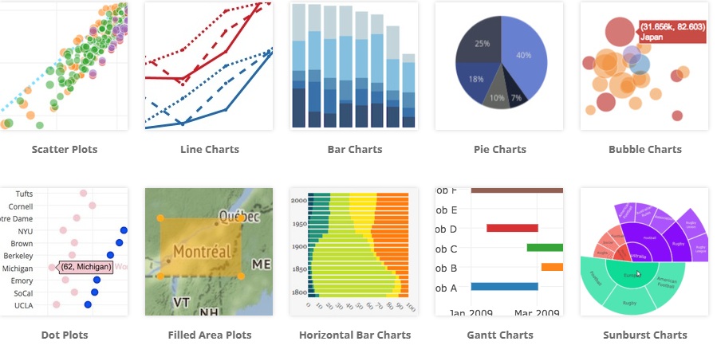

##### **Why plotpy:**

Plotly uses javascript behind the scenes and is used to create interactive plots where we can zoom in on the graph or add additional information like hover data and more.

*Some advantages of plotly:*

- Plotly has hover tool capabilities that allow us to detect any outliers or anomalies in a large number of data points.  
- It is visually appealing and can be accepted by a wide range of audiences.  
- This allows for endless customization of our graphics, making our plot more meaningful and understandable to others.

##### **How to install plotly:**  
We should install plotly as it is not integrated in python. To do this we run this command in our terminal.  
```
pip install plotly 
```

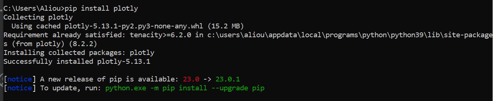

##### **How is plotly structured:**   
There are three main modules in Plotly  
- plotly.plotly serves as an interface between the local machine and Plotly. It contains functions that require a response from the Plotly server.
- The plotly.graph_objects module contains the objects (figure, layout, data and plot definition such as scatterplot, line graph) that are responsible for creating the plots. The figure can be represented as dict or instances of plotly.graph_objects.Figure and these are serialized as JSON before being passed to plotly.js. Figures are represented as trees where the root node has three top layer attributes - data, layout and frames and the named nodes called "attributes".
```
fig = go.Figure(
    data=[go.Bar(x=[1, 2, 3], y=[1, 3, 2])],
    layout=go.Layout(
        title=go.layout.Title(text="A Figure Specified By A Graph Object")
    )
)

fig.show()
```
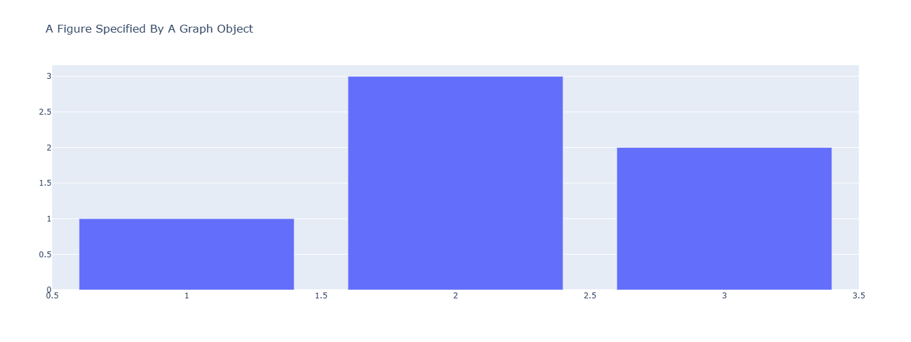
- The plotly.tools module contains various tools in the form of functions that can enhance the Plotly experience.  

>Note: The plotly.express module can create the whole figure in one go. It uses graph_objects internally and returns the graph_objects.Figure instance.
```
# Creating the Figure instance
fig = px.line(x=[1, 2], y=[3, 4])
  
# printing the figure instance
print(fig)
```
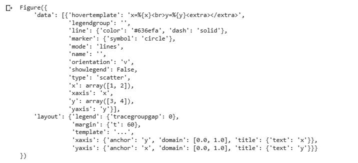

>Note that plotly.express module and plotly.graph_objects module do the same work the difference is that with plotly.graph_objects we can make more settings to modify the rendering to our liking. A picture is worth a thousand words isn't it. :smile:  
```
#Plotly express
fig = px.bar(df, x="Fruit", y="Number Eaten", color="Contestant", barmode="group")
fig.show()
```
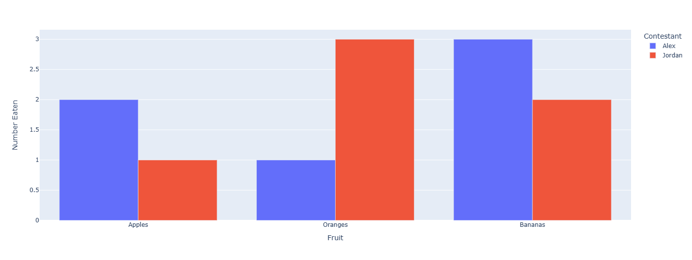

```
# Graph object
fig = go.Figure()
for contestant, group in df.groupby("Contestant"):
    fig.add_trace(go.Bar(x=group["Fruit"], y=group["Number Eaten"], name=contestant,
      hovertemplate="Contestant=%s<br>Fruit=%%{x}<br>Number Eaten=%%{y}<extra></extra>"% contestant))
fig.update_layout(legend_title_text = "Contestant")
fig.update_xaxes(title_text="Fruit")
fig.update_yaxes(title_text="Number Eaten")
fig.show()
```
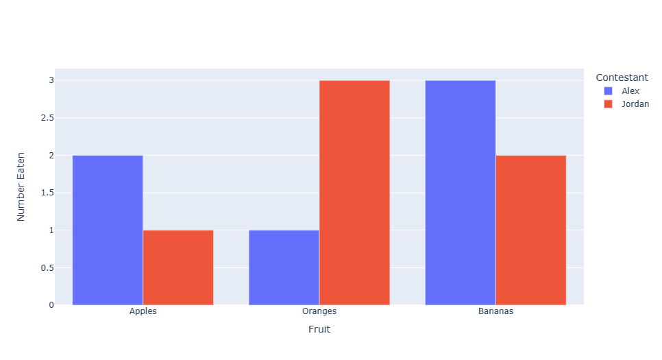

#### **I. Plotpy VS Matplotlib:**

Python already has a graphics library, much older than Plotly, called Matplotlib. This one also allows to create various graphics in a few lines of code and seems to be rather exhaustive.  
>So the question one might ask is, how does Plotly differ from Matplotlib? What is the added value of Plotly?  

The answer lies in the additional modes that Plotly offers. Indeed, unlike Matplotlib, Plotly is a collaborative and interactive library. Thanks to Chart studio, it offers a web service and a collaborative mode which, as mentioned above, allows to download and save data charts on a personal account. It is the interaction with the different servers of Plotly that allows the creation of this web service and the collaborative mode. However, it is possible to activate a mode (by importing the offline package) that allows to prevent the distribution of graphs on the cloud and to make them accessible only on the local. Thus, the connection between the different Plotly servers is interrupted and the collaborative mode stopped.  
Moreover, the visualization of data with Plotly is more advanced than with Matplotlib. It offers the creation of more than 40 different types of graphs, ranging from classic graphs to interactive graphs, animations or 3D graphs.  
Apart from the great simplicity of use and the important capacity of customization of the graphs, another great advantage of Plotly is the ability to detect outliers in a database even in the case of a very large one. In fact, with Plotly it is possible to get information about the data by simply pointing the mouse on the graph. Thus, by reading the graph, one can locate and recover the outliers.  
```
# Data generation: 1000 normal random points
x = np.random.randn(1000)
 
# visualization with matplotlib
plt.hist(x)
plt.show
```
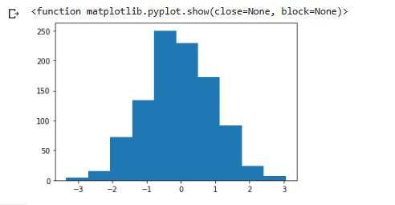

```
# Data generation: 1000 normal random points
x = np.random.randn(1000)
 
# visualization with plotly
fig = px.histogram(x,)
fig.show()
```

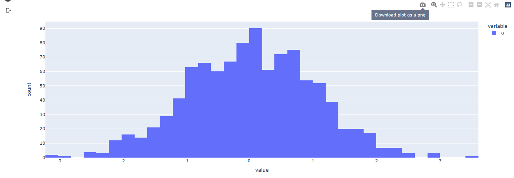
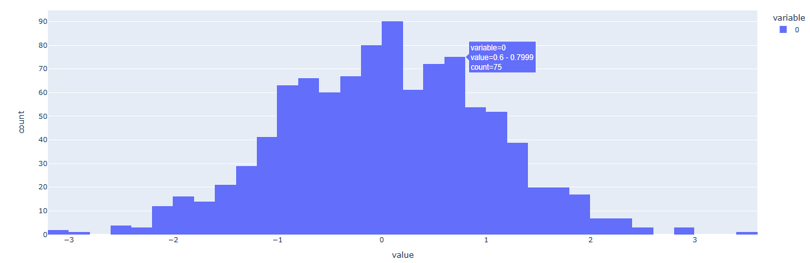

*With these illustrations we can see that there is a big difference between the visualization of these two libraries. On the one hand we have matplotlib which offers us static diagrams and on the other hand plotly which in addition to returning us interactive diagrams it allows us to download our diagrams to reuse them as we wish*

#### **II. Some plotly graphics**

**Line plot:**
```
#using the iris dataset
df = px.data.iris() 
  
# plotting the line chart
fig = px.line(df, x="species", y="petal_width") 
  
# showing the plot
fig.show()
```
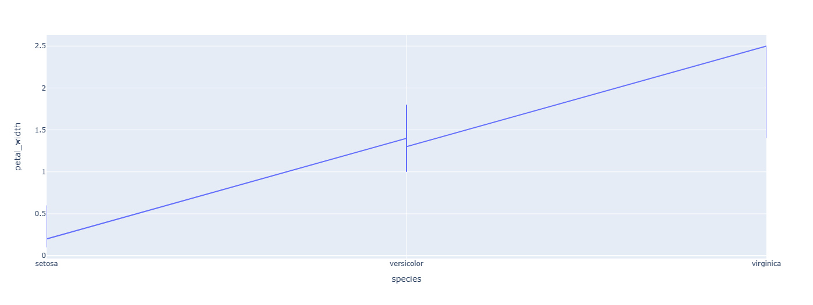

**Bar chart**
```
import plotly.express as px

# using the iris dataset
df = px.data.iris()

# plotting the bar chart
fig = px.bar(df, x="sepal_width", y="sepal_length")

# showing the plot
fig.show()
```
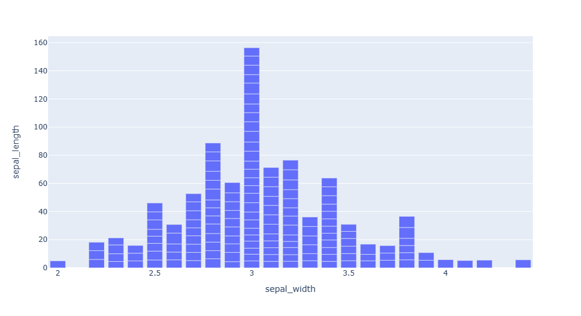

**Pie chart**
```
import plotly.express as px

# using the tips dataset
df = px.data.tips()

# plotting the pie chart
fig = px.pie(df, values="total_bill", names="day")

# showing the plot
fig.show()
```
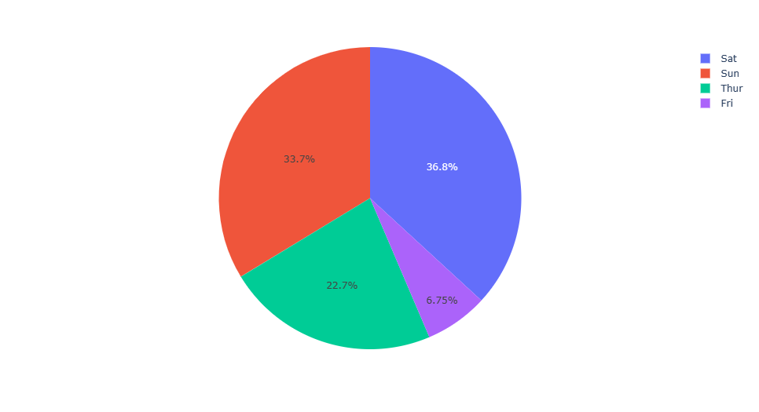

**Scatter plot**
```
df = px.data.iris()

fig = px.scatter(df, x="sepal_width", y="sepal_length", color="species", facet_col="species",
                 title="Adding Traces To Subplots Witin A Plotly Express Figure")

reference_line = go.Scatter(x=[2, 4],
                            y=[4, 8],
                            mode="lines",
                            line=go.scatter.Line(color="gray"),
                            showlegend=False)

fig.add_trace(reference_line, row=1, col=1)
fig.add_trace(reference_line, row=1, col=2)
fig.add_trace(reference_line, row=1, col=3)

fig.show()
```
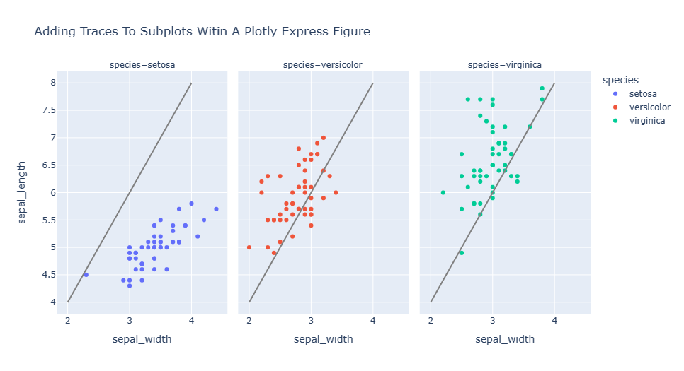

**3D plot**
```
import plotly.express as px

# Data to be plotted
df = px.data.iris()

# Plotting the figure
fig = px.scatter_3d(df, x = 'sepal_width',
					y = 'sepal_length',
					z = 'petal_width',
					color = 'species')

fig.show()
```
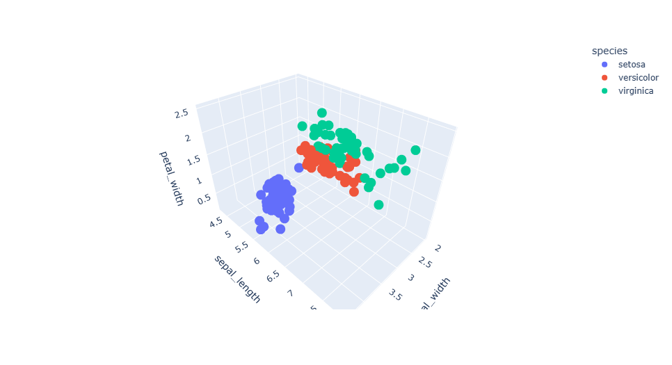

#### **III. Reference:**
- https://plotly.com/python/creating-and-updating-figures/
- https://stacklima.com/utilisation-de-plotly-pour-la-visualisation-de-donnees-interactive-en-python/
- https://plotly.com/python/basic-charts/
- https://pythonhosted.org/plotpy/index.html
- https://datascientest.com/realiser-de-la-data-visualisation-grace-a-plotly
- https://plotly.com/python/graph-objects/
- https://www.geeksforgeeks.org/python-plotly-tutorial/#Package